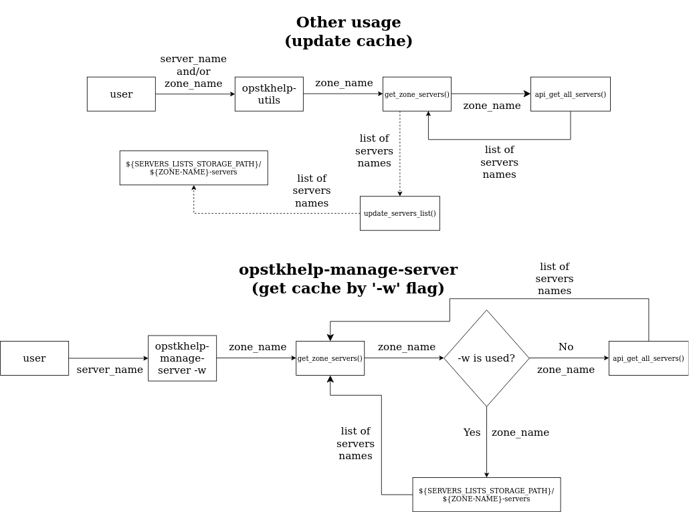

# opstkhelp
CLI utility to simplify working with the OpenStack API

Written entirely in bash

# Motivation
Opstkhelp allows you to manage servers from different openstack zones (rc-zone).

You add all your rc-zones by passing opstkhelp the password and rc-file of that zone. Then you can manage all zones using a single program password, which is set during the installation of opstkhelp.

Using opstkhelp you can:
- start and stop servers with the same name located in different zones with `opstkhelp-manage-server` using just one command
- enter any OpenStack API commands for a specific zone, entering only the name of this zone using `opstkhelp-source-rc`

# Encryption
Zone passwords are encrypted. AES algorithm is used for encryption. For more information see:

# Utils
**For more information, use the '--help' flag**
- `opstkhelp-add-rc`- add a new zone to local storage
- `opstkhelp-remove-rc` - remove zone from local storage
- `opstkhelp-get-info` - get a list of all added zones, servers or server information
- `opstkhelp-source-rc` - enter OpenStack API commands for a specific zone interactively
- `opstkhelp-manage-server` - start or stop the server with the entered name (from a specific zone or all servers with the entered name from all added zones)
- `opstkhelp-uninstall` - opstkhelp removal

# Usage
Before using the program, you must set the global variable `OPSTKHELP_PASSWORD`

Use: `export OPSTKHELP_PASSWORD='your_opstkhelp_password'`

# Cache
The utility `opstkhelp-manage-server` has a flag '-w'. This flag determines whether the program's internal cache is being used or not (). The cache contains information about the names of servers that are located in each attached zone. The cache is updated every time the program receives information about the names of added servers. The question of cache validity remains in the user's responsibility (although you can simply not use the '-w ' flag, but it greatly speeds up the utility). When using an invalid cache, semantic and program errors may occur

- To manually update the cache, you can use `opstkhelp-get-info [ZONE-NAME]`

Detailed information about caching can be found in the corresponding schema:

# Installation
When installing the program, you must enter the password for the program

The installation is performed with the utility `make`

### Executable files
opstkhelp-utils is installed in the `~/.opstkhelp` directory in addition to executable files (opstkhelp-* files). Executable files are installed in the first local directory in order from the `PATH`. If you need to install executable files in a different directory, you can set it using the `BIN_FILES_PATH` variable located in `install.env` file.

### Additional package
Additional packages are installed during installation located in `subfiles/requirements.txt`. By default, the `sudo apt-get install` command is used to install packages. To change this behavior, you need to change the variable `INSTALLATION_COMMAND` located in `install.env` file.

### Commands

- `git clone git@github.com:sncodeGit/opstkhelp.git`

- `cd opstkhelp && make install`

- `cd .. && rm -rf opstkhelp/`

# Uninstallation
`opstkhelp-uninstall`